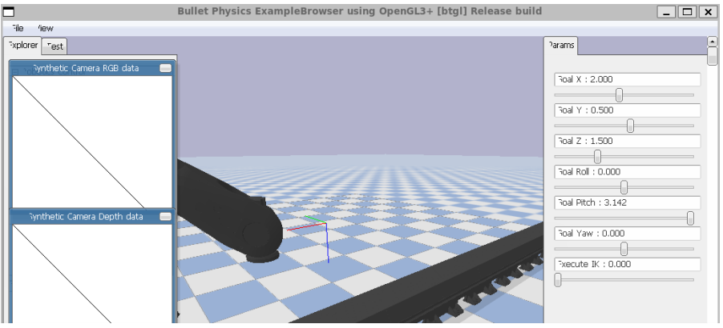
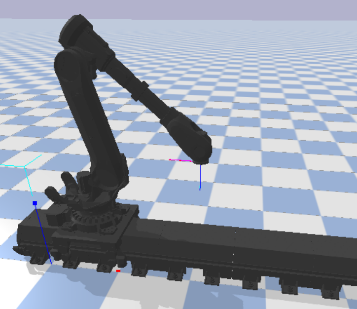
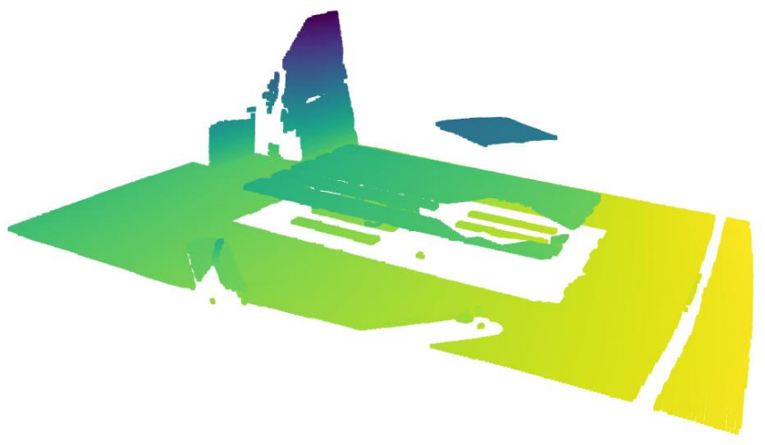
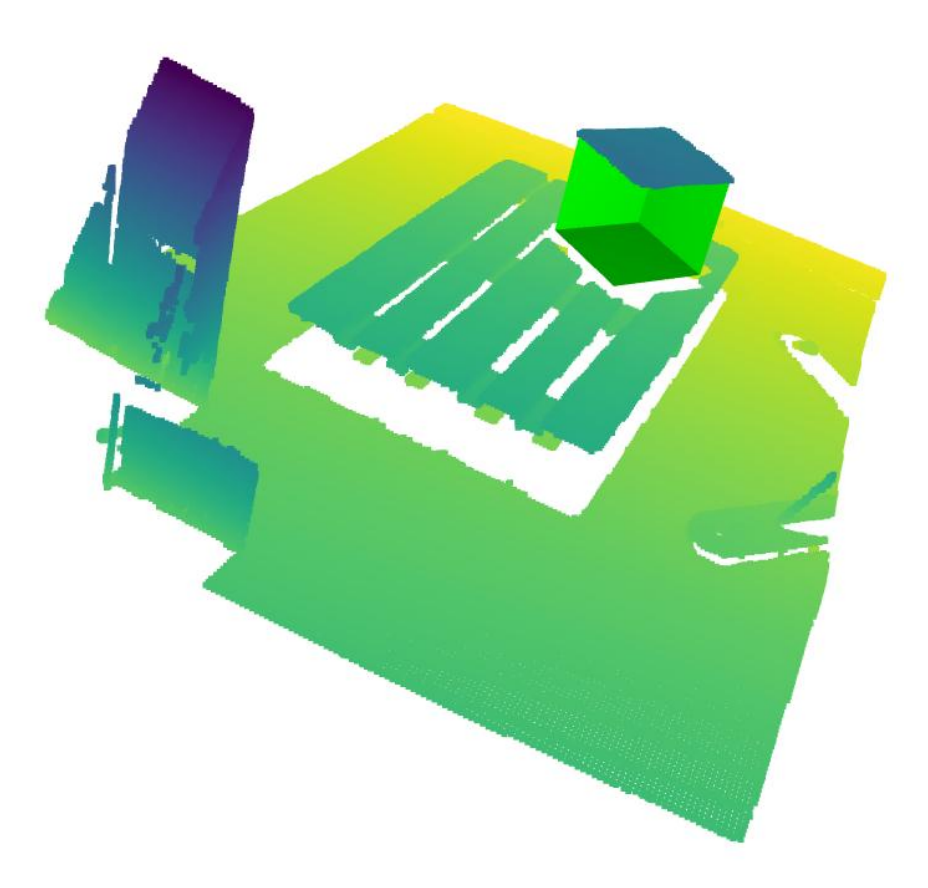

# Robotics Manipulation Task

This repository contains solutions for a robotics manipulation task, focusing on Inverse Kinematics (IK) for a combined linear axis and a 6-DOF industrial manipulator, and 3D pose estimation of a box from depth data.

## IK Solver

The `load_robot.py` script loads the ABB IRB6700 6-DOF industrial robot mounted on a linear axis (rail) into a PyBullet simulation environment. Users can interactively set a desired end-effector goal pose (position and orientation) using sliders within the PyBullet GUI. Once the goal is set, clicking the "Execute IK" slider triggers the numerical Jacobian-based IK solver, which calculates and applies the necessary joint positions for both the linear axis and the robot's joints to reach the specified end-effector pose.

### Simulation UI 

### Exemplery Pose

## Box Pose Estimation

The `box_pose.py` script addresses the bonus objective of estimating the 3D pose of a known box-shaped object from provided depth and color data. It uses geometric methods, including DBSCAN clustering to identify the box's surface points and OpenCV's `minAreaRect` to find its 2D bounding box. The script then estimates the box's pose (translation and orientation) and outputs it as a 4x4 transformation matrix (camera to object frame). The results are visualized by overlaying a reconstructed 3D bounding box onto the point cloud.

### Raw Point Cloud from Depth Map

### Estimated Box Pose Overlay

